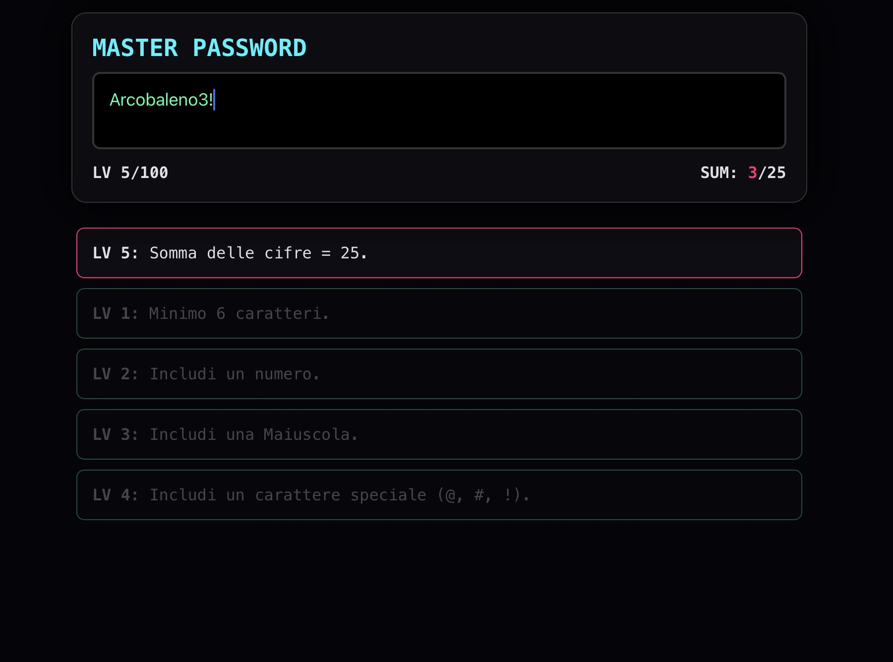

# MasterPassword

MasterPassword è un gioco di logica progressiva in cui il giocatore deve costruire una password sempre più complessa rispettando una serie di regole dinamiche. Ogni livello aggiunge nuove condizioni, rendendo la sfida sempre più caotica e strategica.

Il gioco include:
- 100 livelli di difficoltà progressiva
- Regole logiche, matematiche e linguistiche sempre più complesse
- Elementi visivi e simbolici integrati nelle sfide
- Sistema di “chaos mode” con eventi dinamici (pollo, fuoco, sync)
- Feedback in tempo reale sulle regole rispettate
- Interfaccia minimal e focalizzata sulla scrittura
- Meccaniche di sopravvivenza e pressione crescente

È collegato alla repository centrale MasterGames (https://mastersabba.github.io/MasterSabba/), piena di altri minigame.

